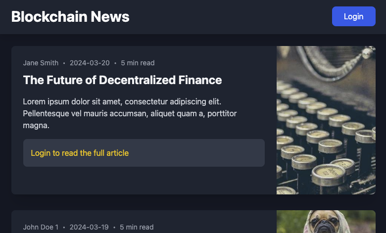

# Access Protocol Payment Gate Integration Demo

The code in this repo shows how to integrate Access Protocol Payment Gate into your website.
You can see the demo in action here: [gate-demo.accessprotocol.co](https://gate-demo.accessprotocol.co)



## Payment gate address

The payment gate is accessible at [gate.accessprotocol.co](https://gate.accessprotocol.co). To integrate it, you'll need:
- A pool address 
- A callback URL for post-payment redirection

Use the `getPaymentGateUrl` function to construct the URL:
```typescript
const gateUrl = getPaymentGateUrl(poolAddress, callbackUrl);
```

## Full Integration Description

All the needed functions and components are in the `@accessprotocol/payment-gate` NPM package.

1. Wrap your app with `AccessSubscriptionProvider`

2. Use `useSubscription` hook to check subscription status. 

3. For gated content:
   - Check `token` existence
   - Show preview/locked state when `token` is null
   - Display full content when `token` exists

4. To verify the user subscription or buy a new one, forward the user to Access Protocol Payment Gate. You can get the appropriate address by calling:
    ```typescript
    getPaymentGateUrl(POOL_ADDRESS, callbackUrl ?? window.location.href)
    ```

5. After the user completes the process at Access Protocol Payment Gate, they get forwarded to the `callbackUrl`. This should be a page in your application that is wrapped inside the `AccessSubscriptionProvider`. This automatically sets the user token, You can again access it using `useSubscription` and enable user to get access to the restricted content.